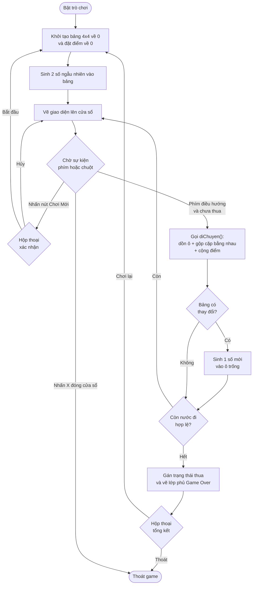

<div align="center">
  <h1>Game 2048 (C++ & SDL2)</h1>

  [](https://cplusplus.com/)
  [](https://www.libsdl.org/)
</div>

---

## 1. Giới thiệu dự án

Dự án phát triển trò chơi 2048 viết bằng ngôn ngữ C++. Phần giao diện đồ họa được xử lý bằng thư viện SDL2. 

- **Môn học:** Lập trình nâng cao
- **Mã LHP:** INT2215 21
- **Nhóm:** 05

## 2. Chức năng chính

- Khởi tạo bảng 4x4 và hiển thị lên cửa sổ.
- Nhận phím bấm từ bàn phím (phím mũi tên hoặc W, A, S, D) để dồn các ô số.
- Gộp 2 ô cùng giá trị khi nằm liền kề theo hướng di chuyển và cộng điểm.
- Hiển thị điểm số hiện tại và điểm kỷ lục.
- Hiển thị hộp thoại xác nhận khi bấm nút Chơi Mới để tránh mất tiến trình do bấm nhầm.
- Hiển thị hộp thoại tổng kết khi thua (Game Over), cho phép chơi lại hoặc thoát.
- Tách rời phần logic và phần giao diện thành các file riêng.

---

## 3. Cấu trúc thư mục

```text
Game 2048/
├── build/                 # Thư mục chứa file .exe sau khi biên dịch
│   ├── Game2048.exe       # File chạy game
│   └── run_test.exe       # File chạy unit test
├── src/                   # Thư mục chứa mã nguồn chính
│   ├── logic.h            # Khai báo biến toàn cục và các hàm xử lý logic
│   ├── logic.cpp          # Xử lý sinh số, di chuyển ô, gộp số, tính điểm
│   └── main.cpp           # Vòng lặp game SDL2, xử lý sự kiện và vẽ giao diện
├── tests/                 # Thư mục chứa file unit test
│   └── test_logic.cpp     # Test các hàm xử lý logic game
├── Makefile               # Cấu hình lệnh biên dịch (build, run, test, clean)
└── README.md              # Tài liệu mô tả dự án
```

---

## 4. Sơ đồ luồng xử lý

Sơ đồ mô tả luồng xử lý chính của game:



## 5. Ví dụ xử lý (Input/Output thuật toán gộp)

Ví dụ gộp ô khi di chuyển sang trái:
- Mảng đầu vào: `[2, 2, 4, 0]`
- Hướng di chuyển: TRÁI
- Kết quả: 2 ô giá trị `2` gộp thành `4` → `[4, 4, 0, 0]`

---

## 6. Hướng dẫn cài đặt và biên dịch

Yêu cầu: trình biên dịch C++ (`gcc`, `g++`) và `make`. Dự án cần thư viện `SDL2`, `SDL2_gfx` và `SDL2_ttf`.

### Trên hệ điều hành Windows
Mở Terminal hoặc Command Prompt tại thư mục chứa dự án.

**Bước 1: Biên dịch chương trình**
```bash
mingw32-make
```

**Bước 2: Khởi chạy trò chơi**
```bash
.\build\Game2048.exe
```

### Trên hệ điều hành macOS / Linux
**Bước 1: Biên dịch chương trình**
```bash
make
```

**Bước 2: Khởi chạy trò chơi**
```bash
./build/Game2048
```

---

## 7. Chạy Unit Test và dọn dẹp

**Chạy unit test:**
File test nằm tại `tests/test_logic.cpp`, kiểm tra logic game độc lập (không cần SDL2).
```bash
# Đối với Windows
mingw32-make test

# Đối với macOS / Linux
make test
```

**Xóa file .exe từ build cũ:**
```bash
# Đối với Windows
mingw32-make clean

# Đối với macOS / Linux
make clean
```